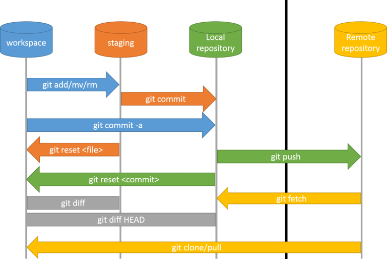

## Git Version Control

[Mənbə](https://github.com/pushpankq/Git-Commands-)

[Mənbə](https://twitter.com/profulsadangi/status/1311319902049972226/photo/1)

* git commit --amend -> add changes to previous commits
* git commit --amend -m "Commit message" -> add changes and change previous commit
* git revert <commit-id> -> delete the changes and create new commit
* git reset --hard <commit-id> -> delete the changes and commits to commit-id
---

* git branch -> shows all branches
* git branch develop -> create new branch
* git checkout develop -> switch to develop branch
* git checkout -b new-branch -> create new branch and switch to the branch
* git branch -d new-branch -> delete new branch

---

* git stash -> stores all changes in workspace and does not commit
* git stash list -> see all stash lists
* git stash clear -> delete the stash list and doesn't appear in workspace
* git stash pop -> come back to the last stashed changes and delete from stash list
* git stash apply <stash-id> -> come back to the last stashed changes and doesn't delete from stash list

---

* git merge <branch-name> -> merge branch to HEAD branch
* git merge --squash <branch-name> -> merge branch to HEAD branch, and then you should write commit message (git commit -m "message")
* git merge --abort -> abort conflict merge
* git rebase -> merge branch to HEAD branch and keep git history clean
* Note: merge create comment but rebase doesn't create comment

---
Useful commands

* watch --color -n 2 "git log --graph --format=format:'%C(bold blue)%h%C(reset) - %C(bold green)(%ar)%C(reset) %C(white)%an%C(reset)%C(bold yellow)%d%C(reset) %C(dim white)- %s%C(reset)' --all"

🎥 Videos
* [Git From the Bits Up](https://www.youtube.com/watch?v=MYP56QJpDr4&ab_channel=InfoQ)
  📝 Articles
* [Merging vs. Rebasing](https://www.atlassian.com/git/tutorials/merging-vs-rebasing#the-golden-rule-of-rebasing)
* [Best Practices for Your Git Branches](https://medium.com/git-happy/10-key-best-practices-for-git-branch-management-b0e7ec4148b9)
* [A Visual Git Reference](https://marklodato.github.io/visual-git-guide/index-en.html)
* 

